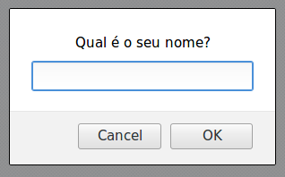

# Parte I - Javascript Básico

## 2. Prompt de entrada


**2.1. Conceito:** 

O prompt serve para pedir algum dado do usuário. Ao acessar determinado link abrirá uma "caixa" de alerta com o texto que informamos, um espaço para resposta do usuário, um botão de "Ok" e outro de "Cancelar". Esta resposta vai ser armazenada como variável. Se o usuário cancelar, a resposta é `null` (nulo).

No JavaScript, `window` é o objeto global. Então, você pode usar tanto `window.prompt("texto aqui")` como a forma reduzida `prompt("texto aqui")`.


**2.2. Estrutura básica:**

```javascript
prompt("algum texto aqui");
```

**2.3. Exemplo:** 

```javascript
/*
estamos definindo a var nome com o 
valor que queremos que apareça na caixa
de inserção do prompt. 
Neste caso, o texto indicativo é: "Qual seu nome?"
*/

var nome = prompt("Qual seu nome?"); 
```
**A saída no seu navegador deve ser algo parecido com isto:**



**2.4. Material complementar:**

- Window prompt() Method (em inglês)

Acesso em: https://www.w3schools.com/jsref/met_win_prompt.asp

- Window.prompt()

Acesso em: https://developer.mozilla.org/pt-BR/docs/Web/API/Window/prompt
